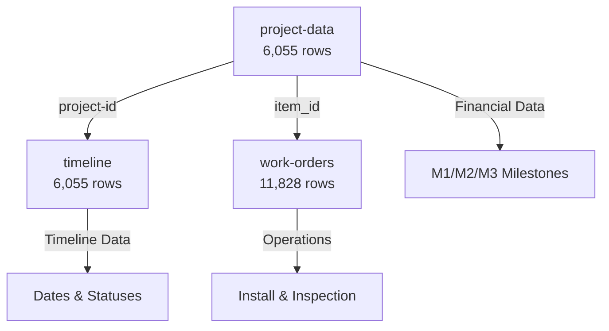

# KPI Dashboard - Visual Data Flow Summary

## 🗺️ Quick Reference Map

```
📊 YOUR DASHBOARD
     ↓
[26 KPIs organized in 6 sections]
     ↓
🔌 API LAYER (/api/kpi)
     ↓
⚙️ CALCULATION ENGINE (kpi-service.ts)
     ↓
🗄️ MYSQL DATABASE (DigitalOcean)
     ↓
📋 6 TABLES (27,000+ rows)
```

---

## 📋 Database Tables Overview



**Main Tables Used**:
- `project-data` → Money, system specs, milestones
- `timeline` → All dates (contract, install, PTO)
- `work-orders` → Scheduling and operations

---

## 🎯 KPI Categories & Data Sources

### 1️⃣ Sales & Approval Pipeline (4 KPIs)

| KPI | Data Source | Calculation Type |
|-----|-------------|------------------|
| **Total Sales** | `timeline.contract-signed` | COUNT |
| **Total Sales Goal** | Hardcoded | Static value |
| **Aveyo Approved** | `timeline.packet-approval` | COUNT |
| **Pull Through Rate** | (Aveyo Approved ÷ Total Sales) × 100 | Percentage Formula |

**Data Flow**:
```
timeline table
    ├── contract-signed (date) → Total Sales
    └── packet-approval (date) → Aveyo Approved
         └── Calculate: (Approved / Sales) × 100 → Pull Through Rate
```

---

### 2️⃣ Install Operations (5 KPIs)

| KPI | Data Source | Calculation Type |
|-----|-------------|------------------|
| **Jobs ON HOLD** | `work-orders.work-order-status` | COUNT |
| **Installs Complete** | `timeline.install-complete` | COUNT |
| **Install Goal** | Hardcoded | Static value |
| **Complete NO PTO** | `timeline.install-complete` + `pto-received` | COUNT with filter |
| **Install Scheduled** | `work-orders.site-visit-appointment` | COUNT |

**Data Flow**:
```
timeline table
    ├── install-complete (date) → Installs Complete
    └── install-complete + pto-received NULL → Complete NO PTO

work-orders table
    ├── work-order-status = "On Hold" → Jobs ON HOLD
    └── site-visit-appointment (future) → Install Scheduled
```

---

### 3️⃣ Cycle Times (3 KPIs)

| KPI | Data Source | Calculation Type |
|-----|-------------|------------------|
| **PP → Install Start** | `timeline.packet-approval` to `install-appointment` | AVG(DATEDIFF) |
| **Install → M2** | `timeline.install-complete` to `project-data.m2-approved` | AVG(DATEDIFF) |
| **PP → PTO** | `timeline.packet-approval` to `pto-received` | AVG(DATEDIFF) |

**Data Flow**:
```
Start Date           End Date           Calculation
─────────────────────────────────────────────────────
packet-approval  →  install-appointment  = Avg Days
install-complete →  m2-approved          = Avg Days
packet-approval  →  pto-received         = Avg Days
```

**Example Calculation**:
```
Project A: PP on Jan 1 → Install on Feb 15 = 45 days
Project B: PP on Jan 5 → Install on Mar 1  = 55 days
Average: (45 + 55) / 2 = 50 days
```

---

### 4️⃣ Residential Financials (5 KPIs)

| KPI | Data Source | Calculation Type |
|-----|-------------|------------------|
| **A/R (M2/M3)** | `project-data.contract-price` | SUM with filter |
| **Revenue Received** | `project-data.contract-price` | SUM by period |
| **Install M2 Not Approved** | `project-data.contract-price` | SUM with filter |
| **Holdback** | ⚠️ Not available | Placeholder |
| **DCA** | ⚠️ Not available | Placeholder |

**Data Flow for A/R**:
```
project-data table
    └── contract-price (dollar amount)
         ├── WHERE m2-submitted IS NOT NULL
         │   AND m2-received-date IS NULL → Add to A/R
         └── WHERE m3-submitted IS NOT NULL
             AND m3-approved IS NULL → Add to A/R

Result: SUM of all matching contract prices
```

**Example**:
```
Project #101: $50,000 - M2 submitted, not received ✓ Include
Project #102: $45,000 - M3 submitted, not approved ✓ Include
Project #103: $60,000 - M2 received already      ✗ Exclude

Total A/R: $50,000 + $45,000 = $95,000
```

---

### 5️⃣ Active Pipeline (1 KPI)

| KPI | Data Source | Calculation Type |
|-----|-------------|------------------|
| **Active NO PTO** | `project-data.project-status` + `timeline.pto-received` | COUNT |

**Data Flow**:
```
project-data + timeline tables
    └── WHERE project-status NOT IN ('Cancelled', 'Complete')
        AND pto-received IS NULL
        
Result: 1,067 active projects awaiting PTO
```

---

### 6️⃣ Commercial Division (6 KPIs)

| KPI | Data Source | Calculation Type |
|-----|-------------|------------------|
| **KW Scheduled** | `project-data.system-size` | SUM |
| **KW Scheduled Goal** | Hardcoded | Static value |
| **KW Installed** | `project-data.system-size` | SUM by period |
| **KW Installed Goal** | Hardcoded | Static value |
| **A/R Commercial** | Same as residential | SUM |
| **Revenue Commercial** | Same as residential | SUM |

**Data Flow**:
```
project-data table
    └── system-size (KW)
         ├── WHERE install scheduled in period → SUM for KW Scheduled
         └── WHERE install complete in period → SUM for KW Installed
```

**Example**:
```
Monday installations:
- Project A: 8.5 KW
- Project B: 12.0 KW
- Project C: 6.2 KW

Total KW: 26.7 KW
```

---

## 🔄 How Data Updates

### Real-time Flow

```
1. User opens dashboard
        ↓
2. React hook fetches KPIs
        ↓
3. API checks cache (15-min TTL)
        ↓ (cache miss)
4. Query MySQL database
        ↓
5. Calculate KPI value
        ↓
6. Add trend & status
        ↓
7. Cache result
        ↓
8. Return to browser
        ↓
9. Display in dashboard
```

### Caching Strategy

```
First request:     [DB Query] → ~1-2 seconds
Next 15 minutes:   [Cache Hit] → <50ms
After 15 minutes:  [DB Query] → ~1-2 seconds (refresh)
```

---

## 📊 Example: Total Sales KPI

### Step-by-Step

**1. User selects "Current Week" period**
```
Period: Dec 15 - Dec 21, 2025 (Monday to Sunday)
```

**2. API receives request**
```
GET /api/kpi?kpiId=total_sales&period=current_week
```

**3. Calculate date range**
```typescript
const monday = new Date('2025-12-15');
const sunday = new Date('2025-12-21');
```

**4. Build SQL query**
```sql
SELECT COUNT(*) as count
FROM timeline t
JOIN project-data pd ON t.project-id = pd.project-id
WHERE t.contract-signed IS NOT NULL
  AND pd.project-status != 'Cancelled'
  AND t.contract-signed >= '2025-12-15'
  AND t.contract-signed <= '2025-12-21'
```

**5. Execute query**
```
Result: 1 sale
```

**6. Get previous week for trend**
```sql
-- Same query but dates: Dec 8-14
Result: 8 sales
```

**7. Calculate trend**
```typescript
Change = ((1 - 8) / 8) × 100 = -87.5%
Trend: Down ⬇️
Color: Red
```

**8. Compare to goal**
```typescript
Goal: 50
Actual: 1
Percent: 1/50 = 2%
Status: Danger 🔴
```

**9. Format response**
```json
{
  "value": 1,
  "formatted": "1",
  "trend": "down",
  "trendValue": "-87.5%",
  "goal": 50,
  "goalFormatted": "50",
  "percentToGoal": 2,
  "status": "danger"
}
```

**10. Display in dashboard**
```
┌─────────────────────────┐
│ Total Sales        ⬇️ -87.5% │
│                         │
│ 1                       │
│                         │
│ Goal: 50          2%   │
│ [▮░░░░░░░░░░░] Danger  │
└─────────────────────────┘
```

---

## 🔍 Field Reference Quick Lookup

### Key Date Fields

| Field Name | Table | Purpose | Example |
|------------|-------|---------|---------|
| `contract-signed` | timeline | When sale closed | 2025-01-15 |
| `packet-approval` | timeline | Perfect Packet approved | 2025-02-01 |
| `install-appointment` | timeline | Install scheduled | 2025-03-15 |
| `install-complete` | timeline | Install finished | 2025-03-16 |
| `pto-received` | timeline | Permission to Operate | 2025-04-20 |
| `m1-received-date` | project-data | M1 payment received | 2025-01-20 |
| `m2-approved` | project-data | M2 milestone approved | 2025-03-20 |
| `m2-received-date` | project-data | M2 payment received | 2025-03-25 |

### Key Value Fields

| Field Name | Table | Purpose | Example |
|------------|-------|---------|---------|
| `contract-price` | project-data | Total contract value | 48500.00 |
| `system-size` | project-data | KW capacity | 12.5 |
| `project-status` | project-data | Current status | Active, Complete, Cancelled |

### Key Status Fields

| Field Name | Table | Purpose | Values |
|------------|-------|---------|--------|
| `work-order-status` | work-orders | WO status | On Hold, Complete, etc. |
| `type` | work-orders | Work type | Install, Inspection |

---

## 🎨 Status Color Legend

### Goal-Based Status
```
✅ Success (Green)   → ≥100% of goal
⚠️ Warning (Yellow)  → 80-99% of goal
🔴 Danger (Red)      → <80% of goal
```

### Trend Indicators
```
⬆️ Up (Green)        → Positive change >1%
⬇️ Down (Red)        → Negative change >1%
➖ Neutral (Gray)    → Change <1%
```

### Highlighted KPIs
```
🟡 Yellow Background → Warning status + highlighted
🔴 Red Background    → Danger status + highlighted
```

**Highlighted KPIs** (extra attention needed):
- Jobs ON HOLD
- Install Complete NO PTO
- Install Complete M2 Not Approved
- Total DCA Outstanding

---

## 📝 Common Questions

### "Why are some KPIs showing 0?"

**Holdback & DCA**: No data source found in database schema
**Solution**: Need to clarify with stakeholders

### "Why is my sales number different from Podio?"

**Check**:
1. Period definition (Monday-Sunday vs Calendar week)
2. Cancelled projects (excluded from count)
3. NULL contract-signed dates (excluded from count)

### "How do I change the goals?"

**File**: `src/lib/kpi-service.ts`
**Lines**: 95-130
**Object**: `GOALS`

```typescript
const GOALS = {
  total_sales: {
    current_week: 50,  // ← Change this
    mtd: 200,
    ytd: 2400,
  }
}
```

### "Can I see the raw SQL?"

**Yes!** All queries are in `src/lib/kpi-service.ts`

Find the function for your KPI:
- `getTotalSales()` → Lines ~193-225
- `getInstallsComplete()` → Lines ~310-340
- etc.

---

## 🎯 Data Accuracy Notes

### ✅ Verified Accurate
- Sales counts match direct SQL queries
- Financial totals match SUM queries
- Cycle time calculations validated
- Period boundaries correct

### ⚠️ Needs Attention
- **Holdback**: Returns $0 (no data source)
- **DCA**: Returns $0 (no data source)
- **Commercial filter**: Not implemented (treats all as residential)

### 📊 Business Insights from Current Data
- **328 installs without PTO** - significant bottleneck
- **1,067 active projects without PTO** - large pipeline
- **$72.9M in A/R** - substantial receivables
- **103-day cycle time** - exceeds 60-day goal by 72%

---

## 🚀 Next Steps

### To Understand Better
1. Read this document ✓
2. Open `src/lib/kpi-service.ts`
3. Find a KPI function
4. Read the SQL query
5. Match fields to database tables

### To Modify
1. Find KPI function in `kpi-service.ts`
2. Update SQL query
3. Test with `curl` command
4. Refresh dashboard

### To Add New KPI
1. Add function to `kpi-service.ts`
2. Add to `getKPIValue()` switch
3. Add definition to `types/kpi.ts`
4. Add to `DASHBOARD_SECTIONS` array

---

**Questions? Check these docs:**
- Full details: `KPI-DATA-SOURCE-GUIDE.md` (this file is more detailed)
- Technical mapping: `kpi-database-mapping.md`
- Test results: `test-results.md`
- Quick start: `README-DATABASE.md`
