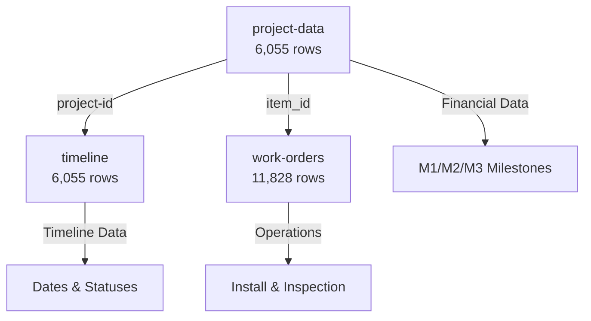

# KPI Dashboard - Visual Data Flow Summary

## 🗺️ Quick Reference Map

```
📊 YOUR DASHBOARD
     ↓
[26 KPIs organized in 6 sections]
     ↓
🔌 API LAYER (/api/kpi)
     ↓
⚙️ CALCULATION ENGINE (kpi-service.ts)
     ↓
🗄️ MYSQL DATABASE (DigitalOcean)
     ↓
📋 6 TABLES (27,000+ rows)
```

---

## 🔄 Recent Updates Summary

### Key Changes Applied:
1. **All cycle time calculations** now use **MEDIAN** instead of AVERAGE for more accurate representation
2. **Duplicate filtering** applied to ALL KPIs using `cancellation-reason != 'Duplicate Project (Error)'`
3. **Period filtering** standardized across all KPIs (determined by filter bar selection)
4. **Total Sales** now includes JOIN to `project` table to verify `project-status != 'Cancelled'`
5. **Aveyo Approved** source changed from `timeline` to `customer-sow` table with DISTINCT count
6. **Pull Through Rate** clarified to use same time period as Total Sales for calculation
7. **Jobs ON HOLD** now includes period filtering and duplicate exclusion
8. **Install Complete NO PTO** enhanced with period filter and `install-stage-status = 'Complete'` requirement
9. **Install Scheduled** counts appointments within the period (not just future appointments)
10. **M2/M3 percentages** confirmed as always 80%/20% split of contract price
11. **Financial KPIs** (A/R, Revenue, Install M2 Not Approved) clarified to use `project-data` table for contract prices
12. **Field name corrections**: `packet-date` (not packet-approval), `m2-approved` in `project-data` table
13. **A/R (M2/M3)** now filters by active project statuses only (Active, New Lender, Finance Hold, Pre-Approvals) - excludes Complete, Cancelled, On Hold, Pending Cancel
14. **A/R (M2/M3)** now displays project count alongside total dollar amount for better insight into pipeline
15. **Revenue Received** now displays project count alongside total dollar amount to show how many projects contributed to revenue

### Database Value Analysis:
- **8 unique project statuses** identified: Active (713), Complete (2,474), Cancelled (2,247), On Hold (286), Pending Cancel (191), Finance Hold (124), Pre-Approvals (6), New Lender (4)
- **7 unique install stage statuses** identified: Complete (3,003), Cancelled (2,277), On Hold (499), In Progress (128), Not Ready (123), Revision Complete - Review (27), Revisions (2)
- **3 unique cancellation reasons** identified: Customer Cancelled (752), Duplicate Project (Error) (161), Missing Required Docs/Info (29)
- **161 duplicate projects** will be excluded from all KPI calculations

---

## 📋 Database Tables Overview



**Main Tables Used**:
- `project-data` → Money, system specs, milestones
- `timeline` → All dates (contract, install, PTO)
- `work-orders` → Scheduling and operations

---

## 🎯 KPI Categories & Data Sources

### 1️⃣ Sales & Approval Pipeline (4 KPIs)

| KPI | Data Source | Calculation Type |
|-----|-------------|------------------|
| **Total Sales** | `timeline.contract-signed` + `project.project-status` | COUNT with JOIN |
| **Total Sales Goal** | Supabase `goals` table | Static value |
| **Aveyo Approved** | `customer-sow.sow-approved-timestamp` | COUNT DISTINCT |
| **Pull Through Rate** | (Active projects ÷ Total Sales) × 100 | Percentage Formula |

**Data Flow**:
```
Total Sales:
  timeline.contract-signed
    JOIN project ON project-id
    WHERE contract-signed IN [period]
      AND project-status != 'Cancelled'
      AND cancellation-reason != 'Duplicate Project (Error)'
    → COUNT

Aveyo Approved:
  customer-sow.sow-approved-timestamp
    WHERE sow-approved-timestamp IN [period]
      AND cancellation-reason != 'Duplicate Project (Error)'
    → COUNT DISTINCT project-id

Pull Through Rate:
  Numerator = COUNT projects WHERE:
    - project-status IN ('Active', 'Complete', 'Pre-Approvals', 'New Lender', 'Finance Hold')
    - contract-signed IN [same period as Total Sales]
    - Exclude 'Duplicate Project (Error)'
  Denominator = Total Sales
  Result = (Numerator / Denominator) × 100
```

---

### 2️⃣ Install Operations (5 KPIs)

| KPI | Data Source | Calculation Type |
|-----|-------------|------------------|
| **Jobs ON HOLD** | `project.project-status` | COUNT by period |
| **Installs Complete** | `timeline.install-complete` + `install-stage-status` | COUNT with filters |
| **Install Goal** | Supabase `goals` table | Static value |
| **Install Complete NO PTO** | `timeline.install-complete` + `pto-received` | COUNT with filters |
| **Install Scheduled** | `timeline.install-appointment` | COUNT by period |

**Data Flow**:
```
Jobs ON HOLD:
  project.project-status = 'On Hold'
    WHERE [filtered by period]
    AND cancellation-reason != 'Duplicate Project (Error)'
    → COUNT

Installs Complete:
  timeline.install-complete
    WHERE install-complete IN [period]
      AND install-stage-status = 'Complete'
      AND cancellation-reason != 'Duplicate Project (Error)'
    → COUNT

Install Complete NO PTO:
  timeline.install-complete
    WHERE install-complete IN [period]
      AND pto-received IS NULL
      AND install-stage-status = 'Complete'
      AND cancellation-reason != 'Duplicate Project (Error)'
    → COUNT

Install Scheduled:
  timeline.install-appointment
    WHERE install-appointment IN [period]
      AND cancellation-reason != 'Duplicate Project (Error)'
    → COUNT appointments in the period
```

---

### 3️⃣ Cycle Times (3 KPIs)

| KPI | Data Source | Calculation Type |
|-----|-------------|------------------|
| **PP → Install Start** | `timeline.packet-date` to `timeline.install-appointment` | MEDIAN DAYS(DATEDIFF) |
| **Install → M2** | `timeline.install-appointment` to `project-data.m2-approved` | MEDIAN DAYS(DATEDIFF) |
| **PP → PTO** | `timeline.packet-date` to `timeline.pto-received` | MEDIAN DAYS(DATEDIFF) |

**Data Flow**:
```
PP → Install Start:
  MEDIAN(DATEDIFF(install-appointment, packet-date))
    WHERE packet-date IS NOT NULL
      AND install-appointment IS NOT NULL
      AND [period determined by filter bar]
      AND cancellation-reason != 'Duplicate Project (Error)'
    → MEDIAN days between packet-date and install-appointment

Install → M2:
  MEDIAN(DATEDIFF(m2-approved, install-appointment))
    JOIN project-data ON project-id
    WHERE install-appointment IS NOT NULL
      AND m2-approved IS NOT NULL (from project-data table)
      AND [period determined by filter bar]
      AND cancellation-reason != 'Duplicate Project (Error)'
    → MEDIAN days between install-appointment and m2-approved

PP → PTO:
  MEDIAN(DATEDIFF(pto-received, packet-date))
    WHERE packet-date IS NOT NULL
      AND pto-received IS NOT NULL
      AND [period determined by filter bar]
      AND cancellation-reason != 'Duplicate Project (Error)'
    → MEDIAN days between packet-date and pto-received
```

**Example Calculation (using MEDIAN)**:
```
Project A: PP on Jan 1 → Install on Feb 15 = 45 days
Project B: PP on Jan 5 → Mar 1  = 55 days
Project C: PP on Jan 10 → Mar 20 = 69 days
Median: 55 days (middle value when sorted: 45, 55, 69)
```

---

### 4️⃣ Residential Financials (5 KPIs)

| KPI | Data Source | Calculation Type |
|-----|-------------|------------------|
| **A/R (M2/M3)** | `project-data.contract-price` + `project-data.m2/m3-submitted/received` | SUM M2 + M3 (active projects only) + COUNT projects |
| **Revenue Received** | `project-data.m1/m2-received-date` + `contract-price` | SUM by period + COUNT projects |
| **Install M2 Not Approved** | `timeline.install-complete` + `project-data.m2-approved` | SUM M2 amounts |

**Data Flow for A/R (M2/M3)**:
```
M2 Outstanding (80% of contract):
  SELECT SUM(pd.`contract-price` * 0.8) AS m2_amount
  FROM `project-data` pd
  LEFT JOIN timeline t ON pd.`project-dev-id` = t.`project-dev-id`
  WHERE pd.`m2-submitted` IS NOT NULL
    AND pd.`m2-received-date` IS NULL
    AND pd.`project-status` IN ('Active', 'New Lender', 'Finance Hold', 'Pre-Approvals')
    AND (t.`cancellation-reason` IS NULL OR t.`cancellation-reason` != 'Duplicate Project (Error)')

M3 Outstanding (20% of contract):
  SELECT SUM(pd.`contract-price` * 0.2) AS m3_amount
  FROM `project-data` pd
  LEFT JOIN timeline t ON pd.`project-dev-id` = t.`project-dev-id`
  WHERE pd.`m3-submitted` IS NOT NULL
    AND pd.`m3-approved` IS NULL
    AND pd.`project-status` IN ('Active', 'New Lender', 'Finance Hold', 'Pre-Approvals')
    AND (t.`cancellation-reason` IS NULL OR t.`cancellation-reason` != 'Duplicate Project (Error)')

Project Count:
  SELECT COUNT(DISTINCT pd.`project-dev-id`) AS project_count
  FROM `project-data` pd
  LEFT JOIN timeline t ON pd.`project-dev-id` = t.`project-dev-id`
  WHERE pd.`project-status` IN ('Active', 'New Lender', 'Finance Hold', 'Pre-Approvals')
    AND (t.`cancellation-reason` IS NULL OR t.`cancellation-reason` != 'Duplicate Project (Error)')
    AND (
      (pd.`m2-submitted` IS NOT NULL AND pd.`m2-received-date` IS NULL)
      OR
      (pd.`m3-submitted` IS NOT NULL AND pd.`m3-approved` IS NULL)
    )

Total A/R = M2 Outstanding + M3 Outstanding
Displayed: Total $ Amount + Number of Projects

✅ ONLY includes active projects (Active, New Lender, Finance Hold, Pre-Approvals)
❌ Excludes Complete, Cancelled, On Hold, Pending Cancel
```

**Data Flow for Revenue Received**:
```
M1 Revenue (20% of contract):
  SELECT SUM(pd.`contract-price` * 0.2) AS m1_revenue
  FROM `project-data` pd
  LEFT JOIN timeline t ON pd.`project-dev-id` = t.`project-dev-id`
  WHERE pd.`m1-received-date` IS NOT NULL
    AND pd.`m1-received-date` IN [period]
    AND (t.`cancellation-reason` IS NULL OR t.`cancellation-reason` != 'Duplicate Project (Error)')

M2 Revenue (80% of contract):
  SELECT SUM(pd.`contract-price` * 0.8) AS m2_revenue
  FROM `project-data` pd
  LEFT JOIN timeline t ON pd.`project-dev-id` = t.`project-dev-id`
  WHERE pd.`m2-received-date` IS NOT NULL
    AND pd.`m2-received-date` IN [period]
    AND (t.`cancellation-reason` IS NULL OR t.`cancellation-reason` != 'Duplicate Project (Error)')

Project Count:
  SELECT COUNT(DISTINCT pd.`project-dev-id`) AS project_count
  FROM `project-data` pd
  LEFT JOIN timeline t ON pd.`project-dev-id` = t.`project-dev-id`
  WHERE (t.`cancellation-reason` IS NULL OR t.`cancellation-reason` != 'Duplicate Project (Error)')
    AND (
      (pd.`m1-received-date` IS NOT NULL AND pd.`m1-received-date` IN [period])
      OR
      (pd.`m2-received-date` IS NOT NULL AND pd.`m2-received-date` IN [period])
    )

Total Revenue = M1 Revenue + M2 Revenue
Displayed: Total $ Amount + Number of Projects

→ SUM of all milestone revenue received in the selected period
```

**Data Flow for Install M2 Not Approved**:
```
SELECT SUM(pd.`contract-price` * 0.8) AS m2_amount
FROM timeline t
JOIN `project-data` pd ON t.`project-dev-id` = pd.`project-dev-id`
WHERE t.`install-complete` IS NOT NULL
  AND pd.`m2-approved` IS NULL
  AND [period determined by filter bar]
  AND t.cancellation-reason != 'Duplicate Project (Error)'
→ SUM of all M2 amounts (80% of contract price) for installs without M2 approval
```

**Example for A/R**:
```
Project #101: $50,000 contract - M2 submitted, not received - Status: Active
  M2 Amount = $50,000 × 0.8 = $40,000 ✓ Include (Active status)

Project #102: $45,000 contract - M3 submitted, not received - Status: Finance Hold
  M3 Amount = $45,000 × 0.2 = $9,000 ✓ Include (Finance Hold status)

Project #103: $60,000 contract - M2 already received
  ✗ Exclude (M2 already received)

Project #104: $55,000 contract - M2 submitted, not received - Status: Complete
  ✗ Exclude (Complete status - not actively pursuing)

Project #105: $48,000 contract - M2 submitted, not received - Status: On Hold
  ✗ Exclude (On Hold status - payment process frozen)

Total A/R Amount: $40,000 + $9,000 = $49,000
Project Count: 2 projects (Projects #101 and #102)

Dashboard Display:
  Primary: $49,000
  Secondary: 2 projects
```

---

### 5️⃣ Active Pipeline (1 KPI)

| KPI | Data Source | Calculation Type |
|-----|-------------|------------------|
| **Active NO PTO** | `project.project-status` + `timeline.pto-received` | COUNT |

**Data Flow**:
```
SELECT COUNT(*)
FROM project p
JOIN timeline t ON p.`project-id` = t.`project-id`
WHERE p.`project-status` IN ('Active', 'Complete', 'Pre-Approvals', 'New Lender', 'Finance Hold')
  AND t.`pto-received` IS NULL
  AND (t.cancellation-reason IS NULL OR t.cancellation-reason != 'Duplicate Project (Error)')
→ COUNT all active projects without PTO (no time period filter)
```

---

### 6️⃣ Commercial Division (6 KPIs)

| KPI | Data Source | Calculation Type |
|-----|-------------|------------------|
| **KW Scheduled** | `project-data.system-size` + `timeline.install-appointment` | SUM by period |
| **KW Scheduled Goal** | Supabase `goals` table | Static value |
| **KW Installed** | `project-data.system-size` + `timeline.install-complete` | SUM by period |
| **KW Installed Goal** | Supabase `goals` table | Static value |

**Data Flow**:
```
KW Scheduled:
  SELECT SUM(pd.`system-size`)
  FROM `project-data` pd
  JOIN timeline t ON pd.`project-id` = t.`project-id`
  WHERE t.`install-appointment` IS NOT NULL
    AND t.`install-complete` IS NULL
    AND [period determined by filter bar]
    AND t.cancellation-reason != 'Duplicate Project (Error)'
  → SUM of system-size for scheduled installations in period

KW Installed:
  SELECT SUM(pd.`system-size`)
  FROM `project-data` pd
  JOIN timeline t ON pd.`project-id` = t.`project-id`
  WHERE t.`install-complete` IS NOT NULL
    AND t.`install-complete` IN [period]
    AND t.cancellation-reason != 'Duplicate Project (Error)'
  → SUM of system-size for completed installations in period
```

**Example**:
```
Week of Dec 15-21 installations:
- Project A: 8.5 KW (completed Dec 16)
- Project B: 12.0 KW (completed Dec 18)
- Project C: 6.2 KW (completed Dec 20)

Total KW Installed: 26.7 KW
```

---

## 🔄 How Data Updates

### Real-time Flow

```
1. User opens dashboard
        ↓
2. React hook fetches KPIs
        ↓
3. API checks cache (15-min TTL)
        ↓ (cache miss)
4. Query MySQL database
        ↓
5. Calculate KPI value
        ↓
6. Add trend & status
        ↓
7. Cache result
        ↓
8. Return to browser
        ↓
9. Display in dashboard
```

### Caching Strategy

```
First request:     [DB Query] → ~1-2 seconds
Next 15 minutes:   [Cache Hit] → <50ms
After 15 minutes:  [DB Query] → ~1-2 seconds (refresh)
```

---

## 📊 Example: Total Sales KPI

### Step-by-Step

**1. User selects "Current Week" period**
```
Period: Dec 15 - Dec 21, 2025 (Monday to Sunday)
```

**2. API receives request**
```
GET /api/kpi?kpiId=total_sales&period=current_week
```

**3. Calculate date range**
```typescript
const monday = new Date('2025-12-15');
const sunday = new Date('2025-12-21');
```

**4. Build SQL query**
```sql
SELECT COUNT(*) as count
FROM timeline t
JOIN project-data pd ON t.project-id = pd.project-id
WHERE t.contract-signed IS NOT NULL
  AND pd.project-status != 'Cancelled'
  AND t.contract-signed >= '2025-12-15'
  AND t.contract-signed <= '2025-12-21'
```

**5. Execute query**
```
Result: 1 sale
```

**6. Get previous week for trend**
```sql
-- Same query but dates: Dec 8-14
Result: 8 sales
```

**7. Calculate trend**
```typescript
Change = ((1 - 8) / 8) × 100 = -87.5%
Trend: Down ⬇️
Color: Red
```

**8. Compare to goal**
```typescript
Goal: 50
Actual: 1
Percent: 1/50 = 2%
Status: Danger 🔴
```

**9. Format response**
```json
{
  "value": 1,
  "formatted": "1",
  "trend": "down",
  "trendValue": "-87.5%",
  "goal": 50,
  "goalFormatted": "50",
  "percentToGoal": 2,
  "status": "danger"
}
```

**10. Display in dashboard**
```
┌─────────────────────────┐
│ Total Sales        ⬇️ -87.5% │
│                         │
│ 1                       │
│                         │
│ Goal: 50          2%   │
│ [▮░░░░░░░░░░░] Danger  │
└─────────────────────────┘
```

---

## 🔍 Field Reference Quick Lookup

### Key Date Fields

| Field Name | Table | Purpose | Example |
|------------|-------|---------|---------|
| `contract-signed` | timeline | When sale closed | 2025-01-15 |
| `packet-date` | timeline | Perfect Packet approved | 2025-02-01 |
| `install-appointment` | timeline | Install scheduled | 2025-03-15 |
| `install-complete` | timeline | Install finished | 2025-03-16 |
| `pto-received` | timeline | Permission to Operate | 2025-04-20 |
| `m1-received-date` | project-data | M1 payment received | 2025-01-20 |
| `m2-approved` | project-data | M2 milestone approved | 2025-03-20 |
| `m2-received-date` | project-data | M2 payment received | 2025-03-25 |

### Key Value Fields

| Field Name | Table | Purpose | Example |
|------------|-------|---------|---------|
| `contract-price` | project-data | Total contract value | 48500.00 |
| `system-size` | project-data | KW capacity | 12.5 |
| `project-status` | project-data | Current status | Active, Complete, Cancelled |

### Key Status Fields

| Field Name | Table | Purpose | Values |
|------------|-------|---------|--------|
| `work-order-status` | work-orders | WO status | On Hold, Complete, etc. |
| `type` | work-orders | Work type | Install, Inspection |

---

## 🎨 Status Color Legend

### Goal-Based Status
```
✅ Success (Green)   → ≥100% of goal
⚠️ Warning (Yellow)  → 80-99% of goal
🔴 Danger (Red)      → <80% of goal
```

### Trend Indicators
```
⬆️ Up (Green)        → Positive change >1%
⬇️ Down (Red)        → Negative change >1%
➖ Neutral (Gray)    → Change <1%
```

### Highlighted KPIs
```
🟡 Yellow Background → Warning status + highlighted
🔴 Red Background    → Danger status + highlighted
```

**Highlighted KPIs** (extra attention needed):
- Jobs ON HOLD
- Install Complete NO PTO
- Install Complete M2 Not Approved
- Total DCA Outstanding

---

## 📝 Common Questions

### "Why are some KPIs showing 0?"

**Holdback & DCA**: No data source found in database schema
**Solution**: Need to clarify with stakeholders

### "Why is my sales number different from Podio?"

**Check**:
1. Period definition (Monday-Sunday vs Calendar week)
2. Cancelled projects (excluded from count)
3. NULL contract-signed dates (excluded from count)

### "How do I change the goals?"

**File**: `src/lib/kpi-service.ts`
**Lines**: 95-130
**Object**: `GOALS`

```typescript
const GOALS = {
  total_sales: {
    current_week: 50,  // ← Change this
    mtd: 200,
    ytd: 2400,
  }
}
```

### "Can I see the raw SQL?"

**Yes!** All queries are in `src/lib/kpi-service.ts`

Find the function for your KPI:
- `getTotalSales()` → Lines ~193-225
- `getInstallsComplete()` → Lines ~310-340
- etc.

---

## 🎯 Data Accuracy Notes

### ✅ Implementation Ready
- All KPI formulas clarified and documented
- Database field values analyzed and verified
- Duplicate filtering strategy defined (161 projects to exclude)
- Period filtering standardized across all KPIs
- MEDIAN calculations specified for all cycle times
- M2/M3 percentage splits confirmed (80%/20%)

### ✅ Financial KPIs Implementation
- **A/R (M2/M3)** - Uses `project-data` table for milestone tracking
  - M2/M3 submission and received dates from `project-data`
  - Filters by active project statuses (Active, New Lender, Finance Hold, Pre-Approvals)
  - Excludes Complete, Cancelled, On Hold, Pending Cancel statuses
- **Revenue Received** - Uses `project-data` table for milestone dates
  - M1/M2 received dates from `project-data`
  - Contract price percentages: M1 = 20%, M2 = 80%
- All financial KPIs now fully functional with `project-data` table

### 📊 Current Database Statistics
- **6,045 total projects** across all statuses
- **3,321 active/complete projects** (55% of total)
- **2,247 cancelled projects** (37% of total)
- **286 projects on hold** (5% of total)
- **161 duplicate projects** to be excluded from all calculations
- **3,003 completed installs** with 'Complete' status

---

## 🚀 Next Steps

### To Understand Better
1. Read this document ✓
2. Open `src/lib/kpi-service.ts`
3. Find a KPI function
4. Read the SQL query
5. Match fields to database tables

### To Modify
1. Find KPI function in `kpi-service.ts`
2. Update SQL query
3. Test with `curl` command
4. Refresh dashboard

### To Add New KPI
1. Add function to `kpi-service.ts`
2. Add to `getKPIValue()` switch
3. Add definition to `types/kpi.ts`
4. Add to `DASHBOARD_SECTIONS` array

---

**Questions? Check these docs:**
- Full details: `KPI-DATA-SOURCE-GUIDE.md` (this file is more detailed)
- Technical mapping: `kpi-database-mapping.md`
- Test results: `test-results.md`
- Quick start: `README-DATABASE.md`
